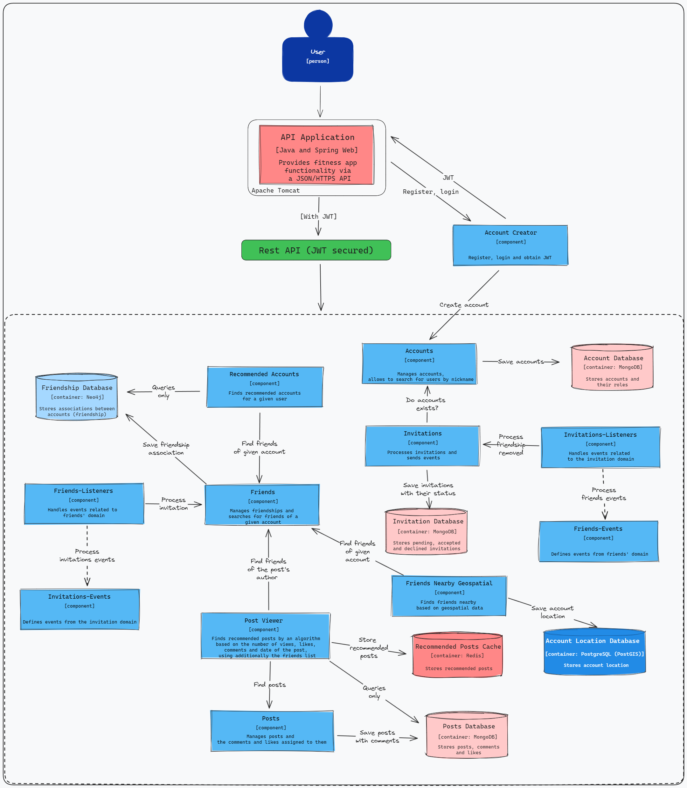
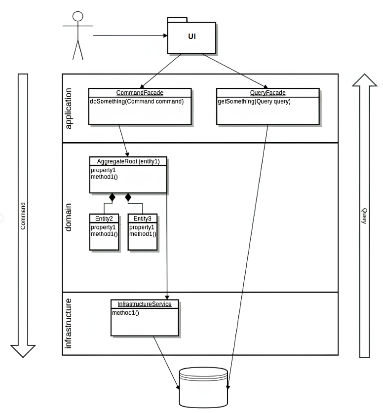
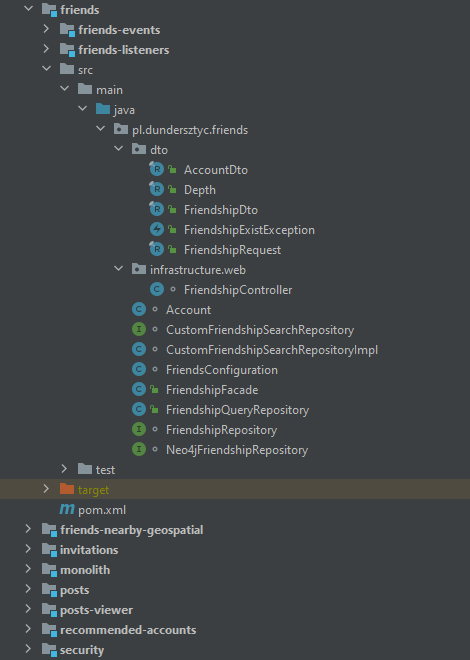

# SocialMedia
SocialMedia is a social networking app where you can express yourself by writing posts, commenting and liking content. In addition, you have the ability to build your circle of friends by sending invitations and finding people near you. Browse recommended posts and discover featured accounts that inspire and fascinate.

## Specification
- Spring Boot, web application
- Modular monolith
- Loosely coupled modules that communicate only through public API (Command/Query Facades)
- Modules are aggregated as Maven modules and most of them have their own database, making it easy to migrate to microservices
- Only facades and DTOs are public in module
- IoC achieved through events and Dependency Injection
- CQS and basics of CQRS pattern
- Databases chosen for concrete business problems
- Fast unit tests (without Spring context)
- Fast component tests, tested as blackboxes
- Integration tests involving many happy and unhappy paths using Testcontainers
- Containerized in Docker

## C3 diagram

## Features
### Invitations
1. add invitation
2. accept invitation
3. decline invitation
4. delete invitation
5. find sent invitations
6. find received invitations

### Friends
1. add friendship
2. remove friendship
3. search for friends of account
4. find friends of friends to the given depth in the graph

### Friends nearby geospatial
1. save account location
2. locate friends nearby based on geospatial data

### Posts
1. add/delete post
2. add/delete comment
3. add/delete like
4. mark post as viewed
5. find posts:
   - by id
   - between dates
   - since date

### Posts viewer
1. discover recommended posts by an algorithm based on number of views, likes, comments and date of the post, using additionally the friends list

### Recommended accounts
1. find recommended accounts for a given user

### Account creator
1. register
2. login
3. obtain JWT

### Accounts
1. save account
2. find account by:
   - id
   - username

## Architecture

## Project structure

## Run
1. Clone the repository: `git clone https://github.com/dundersztyc10/socialmedia.git`
2. Navigate to the project directory: `cd socialmedia`
3. Create and start containers: `docker compose up -d`

## Tech stack
- Java 18
- Spring 6
- Spring Boot 3
- PostgreSQL
- MongoDB
- Neo4j
- Redis
- Docker
- Testcontainers
- JUnit 5
- Mockito
- GitHub Actions
